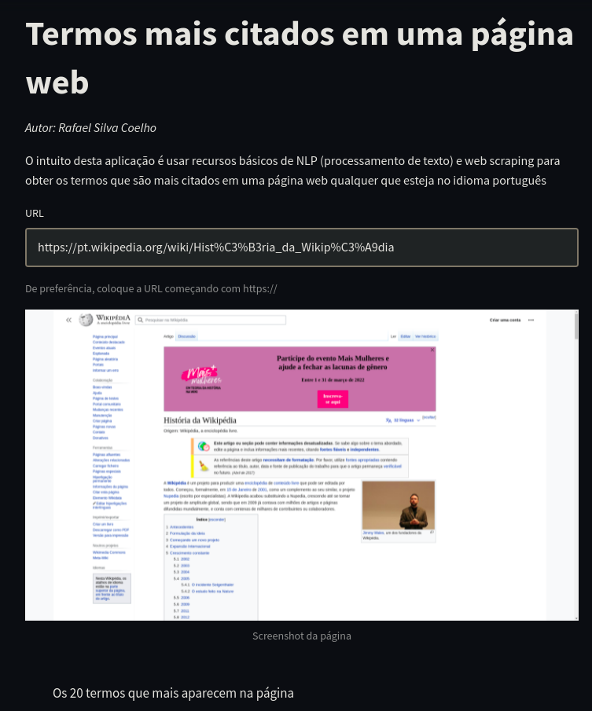
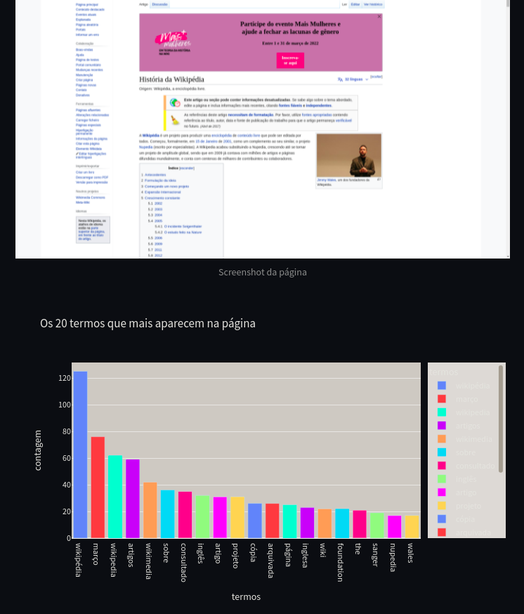

# Processamento de Linguagem Natural (NLP Básico) & Web Scraping

## Objetivo
Obter os termos mais citados em uma página HTML usando Web Scraping e NLP para processamento de texto
O projeto possui dois arquivos principais:
- nlp.py: A aplicação construída é voltada para funcionar com o Streamlit
- nlp.ipynb: Uma versão mais genérica do projeto dentro de um Jupyter Notebook

## Links deste projeto
- A postar

## Recursos utilizados
- Visual Studio Code
- python3.9
- virtualenv
- pip3: gerenciador de pacotes python3.x

## Pacotes do Python
- selenium (Selenium Webdriver)
- webdriver_manager (Webdriver Manager)
- nltk (NLTK: Natural Language Toolkit)
- pandas
- plotly
- streamlit

## Screenshots do projeto construído

